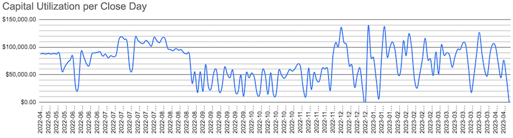

# A Year of Options Trading

---

**None of this is financial, legal, or tax advice. I endorse nothing.**

**Trading options isn’t for everyone.**

---

Remember May, 2022? Spring had just sprung. The Fed just began a series of interest rate hikes. Russian just invaded Ukraine. COVID mask mandates were just beginning to lift in the USA. Mercury just entered its second retrograde of the calendar year. That's when I started the hobby of paper trading options contracts. That's also when the market started oscillating sideways.


_(Figure 1, above, source: Google)_


## Summary
My trades were profitable, but ultimately I'm not convinced that wheeling is worth the effort nor the risk. I'm glad I tried it and I learned a ton about centralized exchanges, traditional finance, trading, and modeling risk.

| 			|		|
|-			|-		|
|Date Start		|Apr 20, 2022	|
|Date Stop		|Apr 14, 2023	|
|Value Start		|$150,000	|
|Value Stop		|$165,000	|
|ROI			|10%		|
|Fees/Commissions	|$550		|
|Risk-Free Rate Start	|[2%](https://home.treasury.gov/resource-center/data-chart-center/interest-rates/TextView?type=daily_treasury_bill_rates&field_tdr_date_value=2022)|
|Risk-Free Rate Stop	|[5%](https://home.treasury.gov/resource-center/data-chart-center/interest-rates/TextView?type=daily_treasury_bill_rates&field_tdr_date_value=2023)|
|`SPY` Start		|$445		|
|`SPY` Stop		|$410		|

_(Table 1, above, Summary of this Study)_

The values in Table 1 are rounded approximations. I was able to generate slightly over 10% returns while the market was mostly flat and the risk-free rate was increasing at its fastest pace in history.


| 	|Count	|Percent	| Median	|Average	| Standard Deviation	| Largest	|
|-------|-------|---------------|---------------|---------------|-----------------------|---------------|
|Losers | 15	| 5.3%		| -$251.34	| $344.35	| $493.24		| -$1,968.57	|
|Winners| 268	| 94.70%	| $31.16	| $76.21	| $152.67		| $1,182.49	|
|Total	| 283	| 100.00%	| $28.66	| $53.92	| $207.50		| N/A		|

_(Table 2, above, P/L stats)_

Table 2 shows that while my average loser was larger than my average winner, I won much more often than I lost. This was part of my "edge". I didn't bother tracking my [Sharpe](https://www.investopedia.com/terms/s/sharperatio.asp) or [Sortino](https://www.investopedia.com/terms/s/sortinoratio.asp) ratios but one could calculate a rough estimate using data from the above tables. Each transaction consisted of between 1 and 10 lots, which is why 283 transactions multiplied by $0.66 (the value I used for fees - explained in more detail below) does not equal $550.


## My Approach
Over the course of the year I learned a great deal through trial and error. I ended up learning a lot about my own trading behavior. While my strategy and attitude towards trading changed throughout the year, some aspects of my approach remained constant. For the entire year I wrote contracts and collected [premiums](https://www.investopedia.com/articles/active-trading/112213/getting-handle-options-premium.asp); I did not buy contracts. In an attempt to make my paper trades as realistic as possible I used a cash account and did not utilize [margin](https://www.investopedia.com/terms/m/margin.asp). All of the calls I sold were covered and all of the puts I sold were cash-secured. At times I found myself running strangles but my legs were always covered. I would typically enter my strangles one leg at a time, waiting for green days to sell calls and red days to sell puts.

While my account size was $150,000, I never utilized more than $138,000 concurrently. I did not include dividends in my accounting but I would have received some. My most profitable strategies were:
1. selling covered calls against healthy dividend equities, like `SCHD` and `KR`, and
2. wheeling indices, like `SPY` and `QQQ`.

My least profitable trade was selling puts against `BBBY`, taking assignment, and then selling the lot outright after it depreciated substantially. These losses taught me to only sell puts against [underlyings](https://www.investopedia.com/terms/u/underlying-asset.asp) I want to own regardless of how enticing the premium seemed. Other losses I experienced were from setting call [strike prices](https://www.investopedia.com/ask/answers/040115/how-do-i-set-strike-price-option.asp) below my [cost basis](https://www.investopedia.com/terms/c/costbasis.asp) then closing out my position for a loss.

Throughout the year I used a Google spreadsheet to track all of my transactions. I entered data by hand which means there may be some errors. Twice I had to record "synthetic trades" because my spreadsheet was designed to only support calls and puts. To record the outright sale an underlying I recorded the sale of a 0 days-to-expiration (DTE) $0.00 premium at-the-money (ATM) call where the strike price was the sale price.

I began the year by selling covered calls because they were easier for me to understand and, at the time, I didn't see any issues with limiting my [upside](https://www.investopedia.com/terms/u/upside.asp). I began with contracts on stocks under $20 in price because I assumed I knew nothing and losing only 2% of the account on any single trade would give me more opportunities to try different things. I later learned that this approach is called [position sizing](https://www.investopedia.com/terms/p/positionsizing.asp). I saw that `HOOD` and `F` traded between $7.00 to $15.00 at the time and call premiums for single lots on these stocks were in the range of $0.25 to $0.75 for monthly contracts. I also bought lots of `SCHD` and sold calls against them. For the first three months, I didn't keep trading notes as I placed orders.

After a few months of selling covered calls I began reading about and selling cash-secured puts. Soon after realizing the benefits of selling puts I began chasing stock with high implied volatility (IV) to collect high premiums. Chasing premiums on high IV stocks was a big mistake. IV is often high for a reason - the crowd may know something you don't. I soon found myself assigned stinker stocks with sinking worth. Most of my losses were from assignment while chasing high premiums. Eventually, I learned to only sell puts on underlyings I wanted to own. I recall reading this recommendation a few times prior to selling puts but I didn't understand the concept of fire until I got burned 🔥. After this assignment, I discovered the benefits of journaling to document my reasoning and emotions while placing orders. Throughout the year, periodically reviewing my notes helped me revise and grow my strategy. I found myself reviewing my notes when a trade would go very well or very wrong.

While I started the year by take profits between 80% and 100%, by the second half the end of the year I would buy-to-close (BTC) some contracts at 30% profits. This percent fluctuated based on my confidence in the trade as well as the amount of time that had passed since opening. For example, I would often BTC early if I could lock in 30% profits in less than 10% of the contract's duration. When selling-to-open (STO) I would tell myself that I'll need to surrender 50% of the collected premium when I BTC. I made damn sure to understand the max profit and max loss of each trade before submitting orders. There were a few orders I messed up on and I had to take small losses to fix.

Around Nov, 2022 I realized that I was selling options rather conservatively OTM. Doing so is how I ensured a high win rate, but premiums that far from the money are small. I was playing a low and slow game that won frequently but didn't pull in big wins. This isn't a great strategy while using an all-cash account as the money would have high yields in a bond or CD. I experienced my first big win on an assigned covered call around Nov and adjusted my behavior to try to capture more from price swings. The majority of my large wins in this study came from [swing trades](https://www.investopedia.com/terms/s/swingtrading.asp) in the second half of the year.


## Lessons Learned

### Strategies and the Greeks
Conceptually, selling options contracts is just like selling insurance while buying contracts is just like buying insurance. Thinking about option contracts as insurance products made them easier for me to learn about.

When learning a new topic I believe definitions are a crucial first step. If you're first starting out it's easy to get lost trying to make sense of all the silly names for different strategies like "condors", "butterflies", "zebras", "lizards", and ["gizzard wizards"](https://www.youtube.com/watch?v=tPTwdE__wXE). I recommend ignoring these contract combinations until you have a strong grasp of the vanilla types: the put and the call. It's also critical to know the difference between a long, a neutral, and a short position.

Besides the different combinations of contract types, understanding [The Greeks](https://www.investopedia.com/terms/g/greeks.asp) is critical. I don't claim to fully understand them but I have a basic intuition of them. An intuition of the Black-Schole-Merton model is also helpful although BSM isn't a perfect model of the real-world. It's also meant to model European-style contracts while I was trading American-style contracts. The math behind the model is neat though as implied volatility (IV) is actually derived from market prices for contracts.

While selling contracts, [theta](https://www.youtube.com/watch?v=McOmcNwqprA) is working [in your favor](https://www.investopedia.com/terms/t/timedecay.asp) and you are said to be short volatility, also called vega. It's important to know the difference between IV (vega) and historical, also called realized, volatility. IV is essentially how uncertain market participants are about something, like the price of an asset. I've read that IV most often (but not always!) overstates realized volatility, meaning the crowd generally expects larger moves than what actually occurs. I've also heard that realized volatility is mean-reverting. Meaning if volatility is high, it will eventually revert towards its average. You just don't know when. This reversion is important because volatility influences a contract's price - the more uncertain the market is about something, the more they are willing to pay for insurance. It's interesting to watch how prices fluctuate leading up to, and during, an FOMC press conference. These moves are vega in action.


### Strike and Expiration Selection
IV tends to increase leading up to binary events like earnings and [FOMC announcements](https://www.federalreserve.gov/monetarypolicy/fomccalendars.htm). After an event is over, volatility drops because the outcome of the event is known. The uncertain becomes certain. This is called volatility crush and is an important concept when trading options with expirations over binary events. Since sellers of contracts are short volatility and volatility vanishes after a binary event, selling a contract over a binary event leads to juicy premiums but it can also lead to assignment. Assignment isn't a good or bad thing but being assigned at the wrong time or for the wrong price can make trading more difficult.

I've found that having confidence in a contract's strike price is very important for me. The strike price of a short put should be at a **fair** price to purchase the underlying. The strike price of a short call should be at a **great** price to sell the underlying. These two rules ensured that I bought low and sold high. To determine what a fair price was I would often look at 2 standard deviation [Bollinger bands](https://www.investopedia.com/terms/b/bollingerbands.asp) using a 20 day [exponential moving average](https://www.investopedia.com/terms/e/ema.asp) (EMA). I would also consider yearly, 6-month, and monthly highs and lows. How much did an underlying move last week? How much might it move in the next week?

When selling puts: I told myself that indices could move 1-3% on a normal day and 5-10% on a bad day. While prices can drop 10-30% in a single day, the COVID crash was relatively recent and I assumed that multiple black swan events rarely occur so near to each other.

When selling calls: it is impossible to lose money if you select call strikes which are above your cost basis. However, it _is_ possible to sell winners too soon. Covered calls limit upside potential. Other traders who run the wheel might recommend selling close to, or at, the money because that is where IV ["smiles"](https://www.investopedia.com/terms/v/volatilitysmile.asp) and premiums are highest. Contrary to this, I prefer selling out-of-the-money (OTM) calls and profiting on the appreciation of the underlying. If the underlying was assigned to me from a prior put I would write calls against it with strike prices between the lot's cost basis and the price of the underlying when I wrote the put. Arguably, this is a mix of wheeling and swing trading as I use assignment as a means of entering/exiting positions.

### Submitting Orders and Rolling
When trading options contracts, one should use [limit orders](https://www.investopedia.com/terms/l/limitorder.asp) and avoid submitting orders outside of market hours as prices can change very quickly and market orders may surprise you. Submit [rolls](https://www.investopedia.com/terms/r/rolling-option.asp), and other multi-leg strategies, in a single order. Otherwise, one leg could fill, the market may move, and then the other legs may be difficult to fill.

I didn't understand when to appropriately roll positions until the last quarter of this study. Rolling is very useful for managing a trade. It is essentially a renegotiation of the contract terms - the strike ([vertical spread](https://www.investopedia.com/terms/v/verticalspread.asp)), the expiration ([horizontal spread](https://www.investopedia.com/terms/h/horizontalspread.asp)), or both ([diagonal spread](https://www.investopedia.com/terms/d/diagonalspread.asp)). I found that a good time to roll is when a contract's strike is ATM with a few days to expiration. Multiple times I favorably altered my strike price by a couple of dollars in exchange for a few more days of time while collecting a credit. Another approach is to roll while the contract's duration still has a majority of its extrinsic value (e.g. sell a 35 DTE contract and roll at 21 DTE). This is what Tastytrade preaches. This reduces exposure to [gamma](https://www.investopedia.com/terms/g/gamma.asp) risk as theta decay accelerates in the last few of weeks of a contract.

I also explored the idea of "manual assignment" which is essentially the opposite of rolling. When it becomes apparent that a contract will be assigned don't wait until it is. BTC the contract and either manually sell the underlying (if a call) or manually buy the underlying (if a put) at market price. This locks in a contract's outcome and allows you to begin selling contracts on the other side of the wheel. I would consider this an advanced maneuver and not something beginners should consider.

### Know Thyself
Much of trading is a psychological battle with yourself. A contrarian view of the world can become tiresome in social situations, but is very valuable for a trader. Every market participant is looking to take your dollars while you are looking to take dollars from any other market participant. It's a fierce and ruthless game. Trading without educating yourself is super risky because other players of the game have been studying for many years.

Trading without a plan is a fast way to lose a bunch of money. Documenting your reasoning when opening a trade can help you to become more mechanical and systematic. It's easy to trade too much. I had to realize that sometimes not trading is best. I think this is in-part shown by Figure 7 (below). In the first 3 months the number of trades I was placing was increasing exponentially. I was learning and was excited to try many different trades. Between months 4 and 10 the number of trades per month was decreasing linearly as I realized managing many trades wasn't resulting in more profit.

I tried a few minutes-in-duration [scalps](https://www.investopedia.com/terms/s/scalping.asp) using `TQQQ` and `SQQQ` but ultimately found it too exciting and unpredictable. It felt like instant lottery tickets. These few trades broke about even. I believe I tried scalping because I was bored while waiting for theta to decay or my BTC limit orders to fill. It is easy to trade too much. If trading feels exciting, I recommend pausing and thinking about why you're placing an order. I find staring at technical patterns and charts makes me overconfident (see [pareidolia](https://en.wikipedia.org/wiki/Pareidolia)) and leads me to over-trade.

### What Gets Measured Gets Improved
I did not track how much time I put into managing positions but I should have. At the beginning of the year, I was reading and researching as if it was a full-time job. Towards the end of the year, I would typically spend about 1-2 hours per day adjusting positions and checking the market.

I was surprised to see how much fees really add up over time. At traditional finance (TradFi) brokers, traders only paying fees for orders which are matched with a counterparty's order. In some decentralized finance ([DeFi](https://www.investopedia.com/decentralized-finance-defi-5113835)) architectures [fees](https://www.investopedia.com/terms/g/gas-ethereum.asp) need to be paid for any submitted order, even ones that are later canceled.

Back in the world of TradFi... While Robinhood is commission free, [PFOF](https://www.investopedia.com/terms/p/paymentoforderflow.asp) spooks me. Paying per transaction is, however, not desirable either. E-trade, JPM, TD, IBKR, and Chucky charge $0.65 transaction. E-trade lowers it to $0.50 if you place 30 transactions per quarter. Tastytrade is $1.00 to open and closing is free. I calculated my fees using $0.66 ($0.01 for exchange fees) per lot per transaction with assignment and expiration being free. $0.65 seems very low in isolation but it really adds up! That's how brokers make their money though. It's became apparent to me that Brokers don't care if you win or lose, so long as you keep playing. The fees are how they make their money. Sometimes the intention of educational material is meant to give you the confidence to keep trading, and keep paying commissions.

I used a spreadsheet to track metrics about my trades with the intention of improving my process. My spreadsheet includes the following column headers: Contract Type, Strike Price, Underlying Ticker, Cost Basis, Open Date, Expiration Date, Contract Duration, Days to Expiration, Close Date, Position Duration, Underlying Price at Open, Underlying Price at Close, Underlying Current Price, Price Change, Price Change Percent, Lots, Open Premium Collected, Close Premium Paid, Option Current Price, Open Fees, Close Fees, Profits and Losses per Day, Total Profits and Losses, Assigned, Group Number, and Notes. For the Underlying Current Price and Option Current Price I would call the following Apps Script function to populate cells:
```
function yahooF(ticker) {
  const url = `https://finance.yahoo.com/quote/${ticker}?p=${ticker}`;
  const res = UrlFetchApp.fetch(url, {muteHttpExceptions: true});
  const contentText = res.getContentText();
  const price = contentText.match(/<fin-streamer(?:.*?)active="">(\d+[,]?[\d\.]+?)<\/fin-streamer>/);
  return price[1];
}
```
This script sometimes returns errors and doesn't show real-time data. I did not use this function or the data it produces to make trading decisions. I used this function to monitor an approximate price of open positions. Less than 10 rows of my spreadsheet would call this function simultaneously.

I also made dashboards from the data in my spreadsheet using Google Sheets' charting tools. While Google Sheets was easy to use, I think I would use Python and Matplotlib if I were to do this again... or, perhaps I'd turn to R... [ggplot2](https://ggplot2.tidyverse.org/) is so darn nice to look at.


## Charts and Dashboards
This section contains images of, and commentary on, the charts I used to track my trade outcomes.


_(Figure 2, above, Dashboard overview)_

I like data. I like looking at data. Figure 2 is a picture of all the dashboards I built using my spreadsheet's data.


_(Figure 3, above, Cumulative P/L)_


I think the key to success is a combination of: avoiding large losses (like the one I took in mid-Feb), taking profits early, setting good strike prices, being patient, and having good luck. Figure 3 shows my wins and losses, less fees, over the year.


_(Figure 4, above, Monthly P/L)_

Figure 4 shows that my profits were lumpy but increasing. Consistent income was difficult to generate given changing market conditions and my low risk tolerance, which is also shown in Table 2 (above). I think having arbitrary goals, like a monthly income target, would have forced me to take on risk I otherwise wouldn't have. I counted profits in the month which a contract closed, expired, or was assigned. Jan was a light trading month because my focus was on family and friends during the end of the year. Other months, like Aug and Sept, were almost a wash. Apr of 2022 is small because I began trading late in the month. I closed 1 transaction that month and only profited about $45.


_(Figure 5, above, Monthly P/L as Percent of Account)_

Figure 5 shows the same data as Figure 4 but as a percent of the capital in the account.


_(Figure 6, above, Per transaction P/L)_

Figure 6 shows P/L over time. Each bar is a single "round trip" defined as a STO followed by a BTC. My largest loss at the end of Feb 2023 was from the sale of `BBBY`. The two losses in Aug 2022 were from selling calls with strikes below my cost basis and then getting assigned. I believe the rest of the draw downs were from rolling and have accompanying upside trades.


_(Figure 7, above, Transactions by Month)_

Figure 7 shows that I likely over traded in Jul and under traded in Jan.



_(Figure 8, above, Required Capital)_

This chart isn't exactly correct but it is a good-enough approximation of how much capital was deployed at any given time. My second most successful month, Nov 2022, had some of the lowest capital requirements. Compare this to Mar 2023 where my profits were similar but with much different capital requirements. Also compare Nov 2022, a very profitable month, to Aug 2022, a not-so-profitable month. I was using almost twice as much capital in Aug as Nov but was nowhere near as profitable. Utilizing more money doesn't lead to more profits.


_(Figure 9, above, Cumulative Fees and Commissions)_

It's important to note that fees are paid with post-tax dollars while profits are pre-tax dollars. Figure 9 illustrates the benefits of using a low/no cost broker. My cumulative opening fees are higher than my cumulative close fees because expiring OTM and taking assignment are free but opening a position always incurs a cost.


_(Figure 10, above, Premium Percent vs Contract Percent)_

Figure 10 shows that I would typically BTC my contracts at 50% profit and typically with more than 50% of its duration remaining. 0 values on the y-axis indicate positions that were not held overnight. 0 values on the x-axis indicate losing trades, rolled positions, and "synthetic trades".


_(Figure 11, above, Durations: Contract vs Position)_


_(Figure 12, above, Contract Duration Histogram)_


_(Figure 13, above, Position Duration Histogram)_

In Figure 11 we see that most of the contracts I sold were less than 20 DTE and I exited most positions after 10 days. I'm not sure if the yellow trend line is significant or not. Figure 12 shows that I typically sold contracts with about 36 DTE or about 14 DTE. There's a typo in the y-axis label of Figure 12. It should read "Contract Duration". Figure 13 shows that while I gravitated towards 2 different contract durations, most of my position durations were less than 10 days.


_(Figure 14, above, Position vs Contract Duration)_

Over time my average contract duration and position duration both shortened. Figure 14 shows this. I think the decrease in the average is from taking profits earlier in the second half of the year. It's also likely caused by my switch from monthly contracts on individual stocks to shorter duration contracts on indices.


_(Figure 15, above, Percent of Premium Collected)_

Figure 15 illustrates that over time I learned to take profits early but I have been hovering just above 50% for the last 6 months of the year. The holes in the running average line are transactions which resulted in losses, such as closing for a loss instead of taking assignment and rolling a contract.


_(Figure 16, above, Cumulative P/L by Group Number)_

Figure 16 shows profits and losses by the transaction's group number. Group numbers are categorical and begin at 0. I had roughly 60 groups. A group consisted of either selling puts only or a full rotation of the wheel (selling puts, getting assigned stock, then selling calls until called away). Some strategies were better than others. Group 25 includes the outright sale of `BBBY`. Groups 44, 47, 52 are from wheeling `SPY` and group 54 is from `QQQ`. The most profitable groups came while being long the underlying, from prior put assignments, while it appreciated. I like to tell myself this was because I set great strike prices, but it's most likely from dumb luck.


_(Figure 17, above, Round Trips by Group Number)_

Figure 17 shows the number of "round trips" by group number. Just as in Figure 16, group numbers along the x-axis are categorical. Many groups consist of a single short put against the underlying. I think what's interesting in this figure is that a group's P/L has little to do with how many trades a group consisted of. This is because different underlyings behave differently (duh) and demand different premiums. Selecting a good underlying is just as important as selecting a good strike and expiration.


_(Figure 18, above, Cumulative Count of Contract Type over Time)_

Figure 18 tells a straight-forward story. I learned the covered call before I understood why anyone would sell a cash-secured put. By the middle of the year I had a strong understanding of both types of contracts. The flattening of lines in Figure 18 shows when I wasn't trading.


## Conclusions and Future Outlook
It took a lot of effort to learn about trading options. I've read that paper trading tends to be more brazen compared to real trading. With treasury bonds near 5% I don't think wheeling for 10% is worth the risk nor the effort. However, comparing the first half of the study (May 2022 through Oct 2022) with the second half of the study (Nov 2022 through April 2023) shows that I was more profitable in the second half by over 50%. I like to think that's because I improved my strategy but it could have been from dumb luck. Another factor to consider is that `SPY` and `QQQ` were in a [downtrend](https://www.investopedia.com/terms/d/downtrend.asp) the first half of this study and began an uptrend in the second half of this study. If I continue paper trading for another 6 months and my P/L exceeds my P/L from the prior 6 months, it may be a sign that 10% is the floor of what this strategy could achieve.

It's difficult to say with any confidence if I would continue to be profitable under different market conditions. In an uptrend, I might set call strike prices farther OTM and put strike prices closer to the money. I may prefer holding the stock instead of holding cash. In a downtrend I would likely do the opposite, prefering to hold cash and attempt to avoid asset depreciations. Easy to say, not easy to do. Especially if I were to use real monies.

Assessing my strategy is a bit of an art especially since the risk-free rate was changing during the year. Damn near every financial decision or model incorporates a risk-free interest rate which typically means the rate set by the FOMC. This rate is used as a "zero" or a reference point to do **all** other calculations. The reason that shifting interest rates causes volatility and uncertainty is that the Fed is literally redefining the "zero" reference point which all other math is built upon. How can you do math or plan for the future when the definition of zero is constantly changing? Besides what the FOMC publicly states, many people will look at the prices of [federal funds futures contracts](https://www.investopedia.com/terms/f/fed-funds-futures.asp) as a means of understanding where speculators believe rates will go.

My speculative outlook: If JoeyB wants to get reelected, he better have a bull market by the primaries. The stock market is not the economy but it's easy to forget that during a bull run. The Fed has said repeatedly that market participants should not expect the FOMC to begin to lower rates until 2024. Lowering rates in the first or second quarter of 2024 may cause equity valuations to spike upwards. This is an ideal time for a rally to begin if the current executive leadership is hoping for a market crescendo near (remember, remember) the 5th of Nov. If JoeyB can't pull together a strong market by the primaries he may lose and markets tend to rally when the GOP runs things. For this reason my gut says to go directly against what I learned this past year and buy deep ITM [LEAPS](https://www.investopedia.com/terms/l/leaps.asp) call options.


# Appendices

## Indices
The below table is a list of indices to consider as underlyings. It's not comprehensive. I grew fond of `SPY` and `QQQ` although `SPLG` and `IWM` may be good funds to start with given their lower price. I never paid too much attention to open interest but I did like having plenty of expiration choices.

|Ticker	|Index		|Multiple	|Strategy	|ER	|Expirations	|
|-------|---------------|---------------|---------------|-------|---------------|
|SPY	|S&P500		|1		|long		|0.09%	|daily		|
|VOO	|S&P500		|1		|long		|0.03%	|monthly	|
|IVV	|S&P500		|1		|long		|0.03%	|weekly		|
|SPLG	|S&P500		|0.1		|long		|0.03%	|monthly	|
|SPUU	|S&P500		|2		|long		|0.63%	|monthly	|
|TQQQ	|Nasdaq-100	|3		|long		|0.86%	|weekly		|
|QLD	|Nasdaq-100	|2		|long		|0.95%	|monthly	|
|QQQ	|Nasdaq-100	|1		|long		|0.20%	|daily		|
|QQQM	|Nasdaq-100	|1		|long		|0.15%	|monthly	|
|NASDX	|Nasdaq-100	|1		|long		|0.50%	|monthly	|
|ONEQ	|Nasdaq-1000	|1		|long		|0.21%	|monthly	|
|VTWO	|Russell 2000	|1		|long		|0.10%	|monthly	|
|IWM	|Russell 2000	|1		|long		|0.19%	|every 2 days	|
|VTI	|Total Market	|1		|long		|0.03%	|monthly	|
|OEF	|S&P100		|1		|long		|0.20%	|monthly	|
|DIA	|DJIA (30)	|1		|long		|0.16%	|weekly		|
|SH	|S&P500		|1		|short		|0.89%	|monthly	|
|SPXU	|S&P500		|3		|short		|0.90%	|weekly		|
|SQQQ	|Nasdaq-100	|3		|short		|0.95%	|weekly		|
|QID	|Nasdaq-100	|2		|short		|0.95%	|monthly	|
|PSQ	|Nasdaq-100	|1		|short		|0.95%	|monthly	|

Other tickers to consider using could include anything with big volume and low correlation to indices, like `TLT`.


## Adages
There are a ton of sayings I repeatedly heard/read. Some are dumb. Many rhyme. A few contradict each other. 1 isn't really an adage.
- buy the dip
- don't try to catch a falling knife
- time in the market beats timing the market
- stay the course
- buy the rumor sell the news
- the trend is your friend
- when in doubt, zoom out
- when the VIX is high, it's time to buy. when the VIX is low, it's time to go (or, look out below)
- be fearful when others are greedy and greedy when others are fearful
- everyone is a genius in a bull market
- let your profits run
- no one ever went broke taking profits
- a fool and his money are easily separated
- it works until it doesn't
- something about swimming naked during low tide
- trading options is like picking up pennies in front of a steam roller
- there's [no benefit to envy](https://www.youtube.com/watch?v=Q3vf3sCCrf0)


## Practical Learning Resources
- [CBOE](https://www.cboe.com/optionsinstitute/)
- I ❤️ [Investopedia](https://www.investopedia.com/)
- [OptionStrat](https://optionstrat.com/) is great for visualizing the P/L of a strategy
- Finviz has a great free [screener](https://finviz.com/screener.ashx?ft=4) and I like their [S&P500 heat map](https://finviz.com/map.ashx). I wish they had one for the NASDAQ-100. [Tradingview](https://www.tradingview.com/heatmap/stock/?color=change&dataset=NASDAQ100&group=sector&size=market_cap_basic) has one, but I don't like it as much. I think being able to visualize the components of an ETF or index would be helpful for understanding the price movements of that index/ETF. For example, if `SPY` skyrockets is that because `AAPL` is on an up trend and is pulling `SPY` up with it? Or, is the increase in `SPY` because the bottom 400 companies are on an up trend?

YouTubes:
- I think watching [Mark Douglas's 'The Exercise'](https://www.youtube.com/watch?v=VwvtVNg4YTE) isn't really useful until you've done 50-100 trades and have had to battle your own fear/greed. After that, it's priceless.
- [The Options Industry Council (OIC)](https://www.youtube.com/@OptionsEdu) is informative but the video are dry
- For some reason [Mike and His White Board](https://www.youtube.com/playlist?list=PLPVve34yolHY43YaBegHMzN9WjrTnQfFr), [InTheMoney Adam](https://www.youtube.com/playlist?list=PLl1r2YBYXhIEbc5st3jtlWDmWO7NA2t91), and the guy in the WallStreetBets logo all have the same haircut. Only the first 2 are useful for learning options.
- [Diamond NestEgg](https://www.youtube.com/c/DiamondNestEgg)'s videos helped me understand bonds and bond funds. I don't find all of her material relevant but I do think her content is factual and non-opinionated. It doesn't feel like she's selling anything.

Reddits:
- r/thetagang
- r/VegaGang
- r/options
- r/Optionswheel
- r/bonds
- r/Economics
- r/StockMarket
- r/Bogleheads
- r/quant
- u/ScottishTrader
- u/ScarletHark


## Random Stuff
- Kaggle has a handful of projects with historical stock/ETF data available for download however I haven't found a free reliable source of historical options prices
- Reservoir Labs created a [Financial Interchange Format protocol parser](https://old.zeek.org/brocon2018/abstracts/InsAndOutsReservoir.pdf) for Zeek. I wonder what they were doing with it.
- [Market Order Matching Engine](https://gist.github.com/jdrew1303/e06361070468f6614d52216fb91b79e5) concepts and the [Liquibook](https://github.com/enewhuis/liquibook) implementation for understanding how traditional/centralized exchanges do what they do.
- Section 3 of [QUANTIFYING THE HIGH-FREQUENCY TRADING "ARMS RACE"](https://www.bis.org/publ/work955.pdf) is neat. With a laptop and home internet a trader will never be able to compete with HFT shops or those who can afford to collocate with exchanges.
